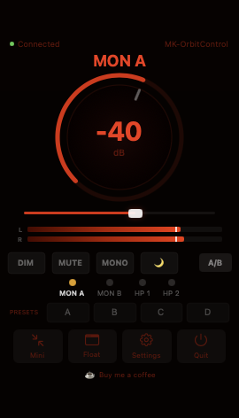
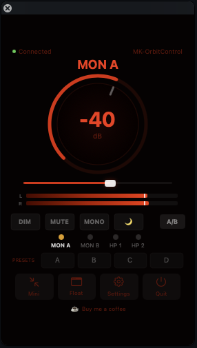

# MK-OrbitControl

Menu bar monitor controller for Antelope Synergy Core audio interfaces.

Quick access to volume, mute, dim, mono, and output selection — directly from your macOS menu bar.

<p align="center">
  
  &nbsp;&nbsp;
  
  &nbsp;&nbsp;
  
</p>
<p align="center"><em>Diablo theme · Floating window · Mini mode</em></p>

## Tested Hardware

| Device | Status |
|--------|--------|
| Antelope Orion Studio III (Synergy Core) | ✅ Tested & working |
| Discrete 4 / Discrete 8 | ⚠️ Untested |
| Galaxy 32 / Galaxy 64 | ⚠️ Untested |
| Orion 32+ Gen4 | ⚠️ Untested |
| Zen Tour Synergy Core | ⚠️ Untested |
| Goliath | ⚠️ Untested |

**Community testing welcome!** If you have an Antelope Synergy Core device, please test and report your results by opening an issue.

## Features

- **Rotary volume knob** with dB display (-∞ to 0 dB)
- **DIM / MUTE / MONO** buttons
- **A/B monitor switching** (quick toggle MON A ↔ MON B)
- **4 preset slots** (right-click to save, click to recall)
- **Night mode** (configurable volume cap: -20 to -60 dB)
- **Peak meters** (L/R with smooth decay)
- **Global hotkeys** (configurable per output, works from any app)
- **Volume HUD overlay** on hotkey press
- **Mini mode** (compact popover — just slider, mute, output selector)
- **12 themes** (Crimson, Midnight, Cyber, Diablo, Nova, Aether, Flux, and more)
- **8 fonts** (System, Hack, Fira Code, JetBrains Mono, Dot Matrix, and more)
- **9 menu bar icons** (Atom, Pulsar, Waveform, and more)
- **Auto device detection** (no manual configuration needed)
- **Auto update checker** (checks GitHub releases daily)

## Requirements

- macOS 13 (Ventura) or later
- Antelope Synergy Core device
- Antelope Launcher installed and running

## Installation

### From DMG (recommended)
1. Download `MK-OrbitControl-v1.0.dmg` from [Releases](../../releases)
2. Open the DMG and drag `MK-OrbitControl.app` to Applications
3. Open Terminal and run: `bash /Volumes/MK-OrbitControl/setup.sh`
4. If macOS blocks the app: **Right-click → Open → Open**
5. The app icon appears in your menu bar

### From source
```bash
git clone https://github.com/YOUR_USERNAME/MK-OrbitControl.git
cd MK-OrbitControl
swift build
# Install Python 3.8 via pyenv for the bridge:
brew install pyenv
pyenv install 3.8.20
~/.pyenv/versions/3.8.20/bin/python3.8 -m pip install zeroconf netifaces
# Extract Antelope modules (run once):
bash dist-bundled/setup.sh
# Run:
.build/debug/MKAntelopeControl
```

## How It Works

MK-OrbitControl communicates with the Antelope Audio server running on your Mac via TCP (localhost). The protocol was reverse-engineered for interoperability purposes under EU Directive 2009/24/EC.

- **State reading:** Connects to the device server port (auto-discovered in range 2020-2025), reads JSON cyclic reports containing volume, mute, dim, mono, and peak meter data
- **Command sending:** Uses a Python 3.8 bridge that leverages Antelope's own RemoteDevice API to send commands safely through the official protocol
- **No proprietary code is distributed.** The setup script extracts necessary modules from your own Antelope Launcher installation

## Architecture

```
┌──────────────┐     TCP/JSON      ┌───────────────────┐     Thunderbolt    ┌──────────┐
│ MK-OrbitControl│ ◄──────────────► │ AntelopeAudioServer│ ◄────────────────► │ Hardware │
│  (Swift UI)    │     :2020-2025  │   (Antelope daemon) │                   │  (Orion)  │
└──────┬───────┘                   └───────────────────┘                   └──────────┘
       │ TCP :17580
       ▼
┌──────────────┐
│  bridge.py    │  Python 3.8 daemon
│ (RemoteDevice)│  Uses Antelope's own API
└──────────────┘
```

## Contributing

Contributions welcome! Especially:
- **Device testing** — test with your Antelope Synergy Core device and report results
- **Channel mapping** — help identify correct MON/HP indices for untested devices
- **Bug reports** — open an issue with your device model and macOS version

## Disclaimer

MK-OrbitControl is **not affiliated with, endorsed by, or associated with Antelope Audio**. All product names are trademarks of their respective owners.

This software is safe. It uses the same command protocol as the official Antelope Control Panel. It cannot modify firmware, device configuration, or cause hardware damage.

## License

MIT License — see [LICENSE](LICENSE)

## Support

Like it? Saved you from clicking through the Control Panel one more time? Want to fund the next feature (Stream Deck support, maybe)?

☕ [Buy me a coffee — I'll turn the caffeine into code](https://buymeacoffee.com/mk_tools)
