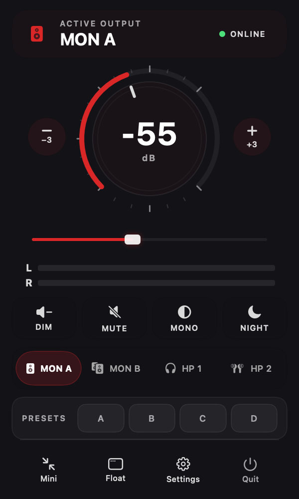
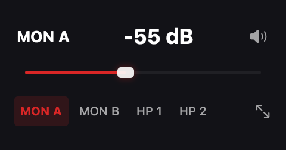

# MK-OrbitControl

**Fast monitor control for Antelope Synergy Core interfaces, directly from the macOS menu bar.**

Adjust volume, mute, dim, mono, and output selection without keeping the Antelope Control Panel open.

<p align="center">
  <a href="https://github.com/mks-devx/MK-OrbitControl/releases/tag/v1.5.0"></a>
  <a href="https://github.com/mks-devx/MK-OrbitControl/actions/workflows/ci.yml"></a>
  <a href="https://github.com/mks-devx/MK-OrbitControl/actions/workflows/codeql.yml"></a>
  <a href="LICENSE"></a>
  
  
</p>

<p align="center">
  <a href="https://github.com/mks-devx/MK-OrbitControl/releases/tag/v1.5.0"><strong>Download MK-OrbitControl v1.5.0</strong></a>
  ·
  <a href="docs/INSTALL.md">Installation guide</a>
  ·
  <a href="https://github.com/mks-devx/MK-OrbitControl/issues">Report compatibility</a>
</p>

<p align="center">
  
  &nbsp;&nbsp;&nbsp;
  
</p>

> [!IMPORTANT]
> v1.5.0 is a **public beta** for Apple Silicon Macs running macOS 13 or later. The DMG is Developer ID signed and Apple notarised. Hardware mappings remain experimental across the wider Synergy Core range, so begin testing at a low monitoring level.

## Why MK-OrbitControl

Monitor level is one of the most frequently used controls in a studio. MK-OrbitControl keeps that control immediate and unobtrusive: one menu-bar click, a global shortcut, or a MIDI control is enough. It complements the official Antelope software; it does not replace device setup, routing, or firmware management.

## Features

| Area | Capabilities |
|---|---|
| **Monitor control** | Rotary control, fast slider, configurable 1/2/3/6 dB steps, mute, dim, and mono |
| **Outputs** | MON A, MON B, HP 1, and HP 2 selection, plus four output-aware preset slots |
| **Fast access** | Configurable global hotkeys, MIDI learn, and an on-screen volume HUD |
| **Display** | Full menu-bar controller, compact Mini mode, and an always-on-top floating window |
| **Metering** | Stereo peak meters with peak hold and level colouring |
| **Appearance** | Multiple themes, Liquid Glass styling, font and menu-bar icon choices, and adjustable background transparency |
| **Protection** | Persistent Night mode volume cap and silence-first startup until valid device state arrives |
| **Recovery** | Automatic reconnection, manual re-scan, and one-click Antelope server restart when offline |

## Compatibility

### Requirements

- macOS 13 or later
- Apple Silicon Mac; Intel builds are not currently distributed or validated
- [Antelope Launcher](https://www.antelopeaudio.com/downloads/) installed and opened at least once
- A connected Antelope Synergy Core interface

The current beta works on the maintainer's Synergy Core setup. That does **not** establish compatibility with every model: Antelope devices can expose different channel mappings and report formats.

| Device | Current status |
|---|---|
| Orion Studio III (Synergy Core) | Previously tested; a controlled v1.5.0 regression pass is still requested |
| Discrete 4 / 8 | Connection investigation needed; currently reported offline |
| Galaxy 32 / 64 | Unverified |
| Orion 32+ Gen4 | Unverified |
| Zen Tour Synergy Core | Unverified |
| Goliath | Unverified |

If you test another model, please [open a compatibility report](https://github.com/mks-devx/MK-OrbitControl/issues) with the device model, macOS version, connection type, and observed output mapping. Do not include serial numbers, account details, or other private data.

## Install the public beta

1. Download the DMG and its SHA-256 checksum from the [v1.5.0 release](https://github.com/mks-devx/MK-OrbitControl/releases/tag/v1.5.0).
2. Optionally verify the download:

   ```bash
   shasum -a 256 MK-OrbitControl-v1.5.0.dmg
   ```

3. Open the DMG and drag **MK-OrbitControl.app** to **Applications**.
4. Launch the app. If prompted, click **Run Setup**.
5. Confirm that the speaker icon appears in the macOS menu bar.

First-run setup extracts the required compatibility modules from the Antelope software already installed on the Mac. Proprietary Antelope code is neither included in the repository nor downloaded by MK-OrbitControl.

Only download release packages from this repository. Do not install app bundles or DMGs shared through issues, forks, email, or third-party links. For checksum verification and first-run troubleshooting, see the [complete installation guide](docs/INSTALL.md).

## Use it

| Action | Control |
|---|---|
| Open the controller | Click the menu-bar icon |
| Adjust volume | Drag the knob or slider; use −/+ for repeatable steps |
| Toggle monitor functions | Click DIM, MUTE, or MONO |
| Change output | Select MON A, MON B, HP 1, or HP 2 |
| Recall a preset | Click A–D |
| Save a preset | Right-click A–D |
| Configure shortcuts or MIDI | Open Settings → Hotkeys or Settings → MIDI |
| Change the interface | Use the header controls for Mini or Floating mode |

The meter refresh rate is approximately 3 fps because the Antelope server reports cyclic state at roughly 300 ms intervals.

## If the app is offline

Check these in order:

1. Confirm the interface is powered on, connected, and visible in the official Antelope Control Panel.
2. Confirm Antelope Launcher is running.
3. Click **Reconnect** in MK-OrbitControl.
4. If it remains offline, use **Restart Server** and allow the app to reconnect.
5. If your model has not been validated, [report the result](https://github.com/mks-devx/MK-OrbitControl/issues) rather than repeatedly changing outputs at an audible level.

If setup reports that Antelope software is missing, install and open Antelope Launcher once, then run setup again. Do not disable Gatekeeper for an official release; redownload the DMG, verify its checksum, and report a persistent signing error. More detail is available in [docs/INSTALL.md](docs/INSTALL.md).

## Security and safety model

- The command bridge binds only to `127.0.0.1` and requires a random per-install authentication token.
- Commands are restricted to validated monitor actions and bounded volume values.
- The app remains silent until it receives a valid initial device state.
- No privileged helper, launch daemon, analytics service, or cloud account is installed by MK-OrbitControl.
- Release packaging audits the app for private paths, personal email addresses, credential-like content, dependency drift, and required third-party licences.

Audio hardware is still the final authority. Keep physical monitor controls accessible and begin at a conservative level when testing an unverified device or output mapping.

Please report security issues privately using the process in [SECURITY.md](SECURITY.md), not through a public issue.

## How it works

```text
┌──────────────────┐   authenticated TCP    ┌────────────────┐   device API    ┌──────────────────────┐
│ MK-OrbitControl  │ ─── 127.0.0.1:17580 ─► │ Local bridge   │ ──────────────► │ AntelopeAudioServer  │
│ SwiftUI menu app │                        │ Python 3.8      │                 │ local dynamic port   │
└──────────────────┘                        └────────────────┘                 └──────────┬───────────┘
                                                                                       │ Thunderbolt
                                                                                       ▼
                                                                                Synergy Core hardware
```

The local bridge exists because the installed Antelope modules currently require Python 3.8 bytecode compatibility. Python 3.8 is end-of-life, so replacing this layer remains an important long-term hardening goal.

The device protocol was reverse engineered solely for interoperability. MK-OrbitControl is not affiliated with, endorsed by, or supported by Antelope Audio.

<details>
<summary><strong>Protocol and channel reference</strong></summary>

The bridge uses length-prefixed JSON messages and exposes only these commands:

| Command | Parameters |
|---|---|
| `set_volume` | channel 0–6, value 0–96 |
| `set_mute` | channel, 0/1 |
| `set_dim` | channel, 0/1 |
| `set_mono` | channel, 0/1 |

Volume values are inverted: `0` is 0 dB, `95` is −95 dB, and `96` is −∞. The known Orion Studio III mapping is MON A `0`, HP 1 `1`, HP 2 `2`, and MON B `5`; indices `3`, `4`, and `6` remain unmapped.

</details>

## Build and test

### Prerequisites

- Xcode and its command-line tools
- [XcodeGen](https://github.com/yonaskolb/XcodeGen)
- Python 3.8.20 with `zeroconf` and `netifaces`
- Antelope Launcher for local module extraction and hardware testing

```bash
git clone https://github.com/mks-devx/MK-OrbitControl.git
cd MK-OrbitControl

brew install xcodegen pyenv
pyenv install 3.8.20
"$HOME/.pyenv/versions/3.8.20/bin/python3.8" -m pip install zeroconf netifaces

xcodegen generate --spec project.yml
bash setup.sh
swift test
python3 -m unittest discover -s Tests -p 'test_*.py'
bash scripts/privacy-audit.sh
```

To build an unsigned local audit package:

```bash
ALLOW_UNTAGGED_BUILD=1 ALLOW_DIRTY_BUILD=1 bash build-dist.sh
```

Public packages must come from a clean checkout at an annotated `vX.Y.Z` tag. Developer ID distribution also requires a valid signing identity and Apple notarisation profile. The packaging script rejects an unnotarised Developer ID build.

### Repository layout

```text
Config/                         App metadata and canonical artwork
Sources/MKOrbitControl/         Swift application source
Tests/                          Swift and Python regression tests
docs/                           Installation and design documentation
licenses/                       Third-party licence texts
scripts/                        Build, release, and privacy validation
bridge.py                       Authenticated local command bridge
setup.sh                        Local Antelope module extraction
build-dist.sh                   Reproducible app and DMG packaging
```

Generated packages belong in the ignored `dist-bundled/` directory and must not be committed.

## Contributing

Focused contributions are welcome, especially:

- controlled device compatibility reports and channel mappings
- reproducible connection or recovery bugs
- accessibility, contrast, and macOS behaviour fixes
- tests that protect existing monitor-control behaviour

Before submitting a change, read [SECURITY.md](SECURITY.md), follow the established [design direction](docs/DESIGN.md), run the test and privacy commands above, and avoid posting logs that contain personal paths, email addresses, serial numbers, tokens, or account data.

## Release history

**v1.5.0** is the first signed and Apple-notarised public beta. It introduced authenticated local bridge access, hardened connection recovery, improved output controls and appearance options, removed the discontinued widget experiment, and added release privacy checks plus Swift, Python, and CodeQL validation.

See [GitHub Releases](https://github.com/mks-devx/MK-OrbitControl/releases) for downloads, checksums, and release notes.

## Uninstall

1. Disable **Launch at Login** in MK-OrbitControl Settings.
2. Move **MK-OrbitControl.app** from Applications to the Bin.
3. Optionally remove its support folder from `~/Library/Application Support/MK-OrbitControl` and its saved preferences.

MK-OrbitControl installs no privileged helper, launch daemon, or system service. Antelope Launcher's own services are separate and are not removed.

## Licence and acknowledgements

MK-OrbitControl is available under the [MIT Licence](LICENSE). Distribution packages include [third-party notices](THIRD_PARTY_NOTICES.md) and the complete applicable licence texts.

Antelope Audio and Synergy Core are trademarks of their respective owner. Their use here identifies compatible products and does not imply affiliation or endorsement.
